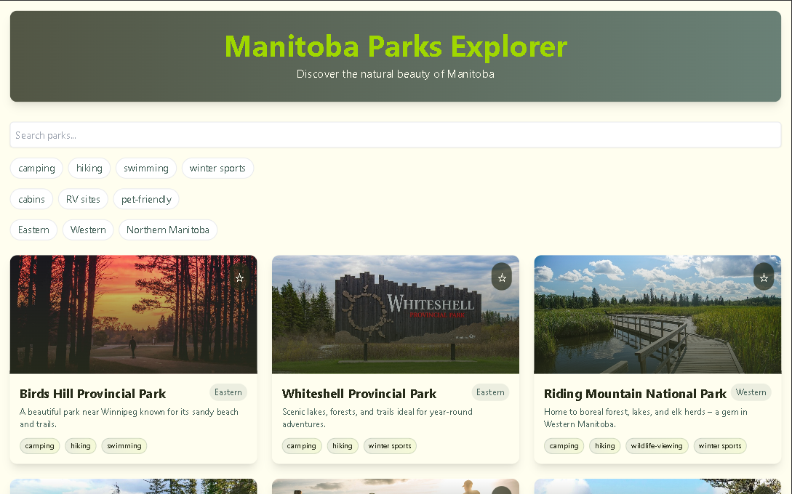

# 🏞️ Park Explorer

A modern, interactive web app to explore parks across Manitoba. Browse park info, filter by region, and view facilities & activities in a clean UI.

### 🔗 Live Demo
👉 [View Live Site](https://askweb14.netlify.app/)

---

## 🚀 Features

- Interactive park listing
- Filter parks by region or activity
- Display of facilities and amenities
- Mobile-first responsive design

---

## 🧰 Tech Stack

- React
- Tailwind CSS
- JSON data
- Vite

---

## 📸 Screenshot



---

## 📦 Getting Started

1. Clone the repo:
```bash
git clone https://github.com/abdulsalamkhan441/park-explorer.git
